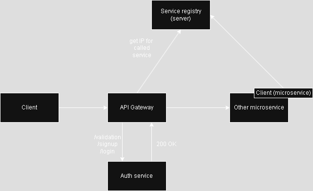

# CV submit organizer

## Overview
The goal of this app is to mainly character of learning things - especially:
- how to deal with microservices
- following Hexagonal Architecture (ports & adapters) and DDD concepts

Also, it has the goal to make possibility to have an organizer/manager for own CVs and be able to set the status of potential recruitment.

## Current progress
Current progress is limited only to simple basics such as authentication service, API Gateway and configured service registry.

##Technology stack
- backend
    - development
        - Java 21
        - maven
        - Spring Boot 3.4
            - Spring Data JPA
            - Spring Cloud
            - Spring Security
        - lombok
        - flyway (dev DB versioning)
        - PostgresSQL 14.4
        - MailDev - imitates mailbox
    - testing
        - JUnit 5 (unit tests)
        - TestContainers (integration tests)
- deployment
    - docker
    - Kubernetes

Future possible technologies:
- frontend
    - Angular (latest)
- deployment
    - CI/CD as GitHub Actions
    - Swagger (to auto-documentation)
## Architecture
Main concepts used in application is hexagonal architecture and Domain Driven Design and microservices.

Very basic theoretical flow:

## API
### Auth-service
BASE-URL: instance-id/api/v1/auth
- auth-service
    - signup
    - login
    - verification?token={token} (verification email)
    - - verification/resend?token={old_expired_token}
    - validation (validation login token)
